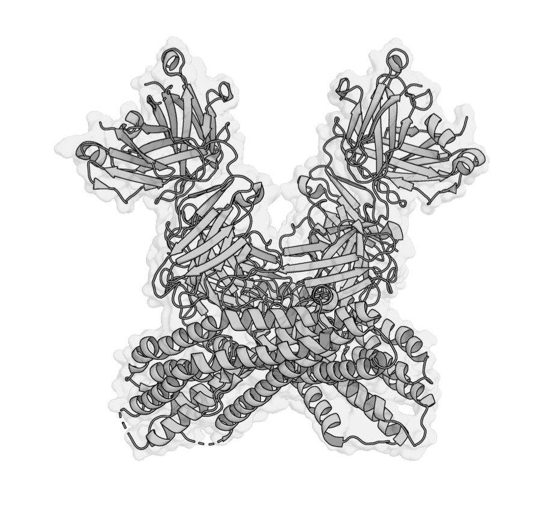
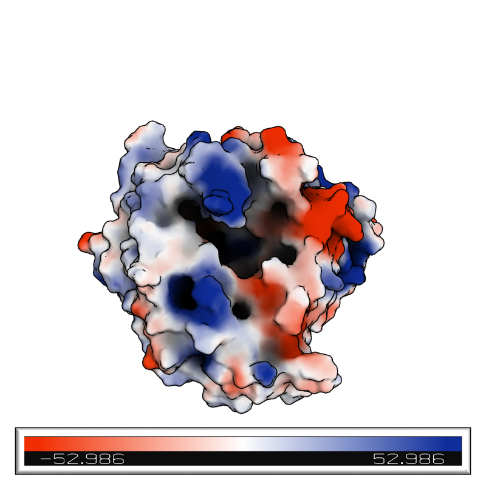
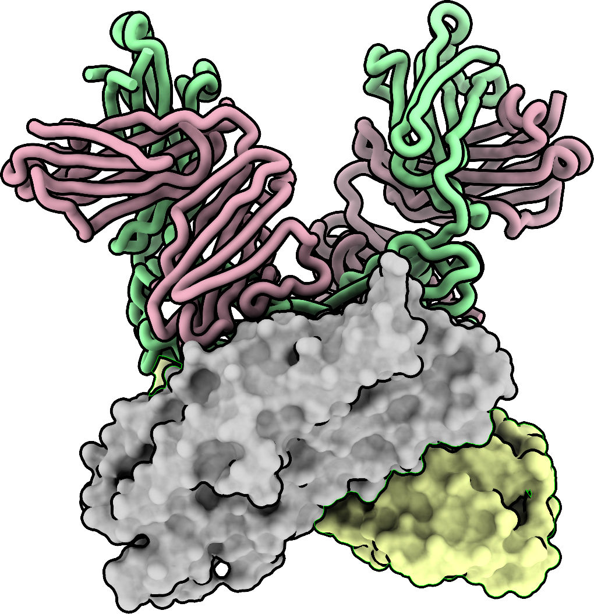

Speeding up a few things because I am lazy. More updates to come as I think of something.

## Preface

Firstly a quick guide on how to connect to **Milton**, in case anyone hasn't used it before.

NOTE: IF YOU DON'T HAVE ACCESS TO VAST SCRATCH, THEN IT USES THE PATH OF YOUR PERSONAL FOLDER
```
/home/users/allstaff/[WEHI_USERNAME]
```

### Option 1: Using Open OnDemand (recommended if you have access)

1. Go to the [Open OnDemand portal](https://ondemand.wehi.edu.au).
2. Log in with your WEHI credentials.
3. From the dashboard, open **Files** or navigate to your project directory.
4. Click **Open in Terminal** — this drops you straight into a working terminal on Milton.

### Option 2: If you don't use Open OnDemand - keep your files in your personal share folder!

1. Open the **Terminal** app on your Mac
2. Type the following command and press **Enter**:
   ```
   ssh slurm-login
   ```
3. Log in as before

You can then run 
```
git clone https://github.com/CubeJerry/ThamLabQoL.git
```
and download all the scripts here with ease.


## AlphaFold Predictions
Want to run a structure prediction but have a sequence you don't want to disclose via the online version? Use the scripts in the ***alphafold*** folder.

[See full instructions →](docs/alphafold.md)
   
   
## ProtParam Calculations
Tired of constantly copypasting sequences into ProtParam and hitting enter, then having to scroll down to find the number you're looking for?  Use the scripts in the ***protparam*** folder.

Scripts provided for both .csv and fasta files.

[See full instructions →](docs/protparam.md)

## Chimera X and PyMOL figures
Want to generate figures like the ones below, but have a bunch of proteins so you can't be bothered adjusting settings for each individual chain one at a time? Use the scripts in ***chimerax*** or ***pymol***

### outline


### complexfig


### electropot


### cxfig



[See full instructions →](docs/modelling.md)

## Prepare CryoEM data
Data from MediaFlux needs to be downloaded and modified before feeding into CryoSparc. This script speeds things up by processing every file simultaneously and outputs them to a folder in your VAST Scratch.

Simply run ```bash cryoemprep.sh``` and follow the prompts.

Tip: set hash_max to a higher number if ray tracing is taking too long (may need to play around a bit)
